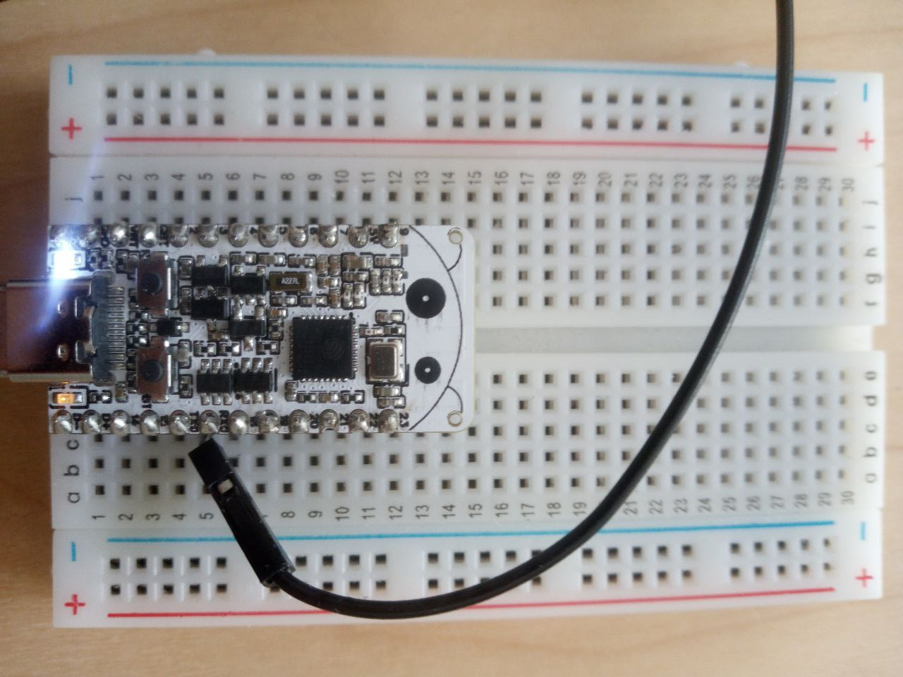
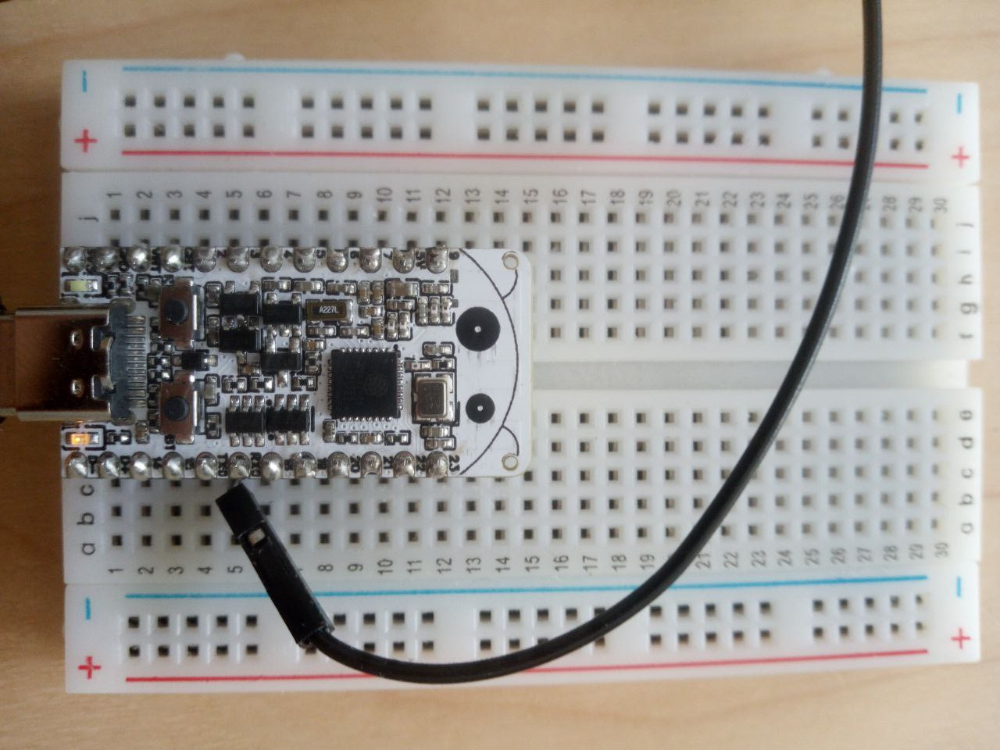

# esp32-led-blink-sdk

This example demonstrates how to integrate with the ESP-IDF SDK via CMake and how to use the standard GPIO library to control LED from Swift. This example is specifically made for the RISC-V MCUs from ESP32 (the Xtensa MCUs are not currently supported by Swift).




## Requirements

- Set up the [ESP-IDF](https://docs.espressif.com/projects/esp-idf/en/stable/esp32/) development environment. Follow the steps in the [ESP32-C6 "Get Started" guide](https://docs.espressif.com/projects/esp-idf/en/v5.2/esp32c6/get-started/index.html).
  - Make sure you specifically set up development for the RISC-V ESP32-C6, and not the Xtensa based products.
  
- Before trying to use Swift with the ESP-IDF SDK, make sure your environment works and can build the provided C/C++ sample projects, in particular:
  - Try building and running the "get-started/blink" example from ESP-IDF written in C.

## Building

- Make sure you have a recent nightly Swift toolchain that has Embedded Swift support.
- If needed, run export.sh to get access to the idf.py script from ESP-IDF.
- Specify the nightly toolchain to be used via the `TOOLCHAINS` environment variable and the target board type by using `idf.py set-target`.
``` console
$ cd esp32-led-blink-sdk
$ export TOOLCHAINS=...
$ . <path-to-esp-idf>/export.sh
$ idf.py set-target esp32c6
$ idf.py build
```

## Running

- Connect the Esp32-C6-Bug board (or any other board with integrated LED on GPIO pin 8) over a USB cable to your Mac. Alternatively you can just connect external LED to GPIO pin 8 on any other board.
- Connect RX pin of USB-UART converter to TX0 pin of your board if you need serial ouput. You may also need to connect GND converter pin to the GND pin of the board.
- Use `idf.py` to upload the firmware and to run it:

```console
$ idf.py flash
```

- The LED should be blinking now.
